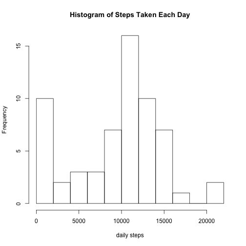
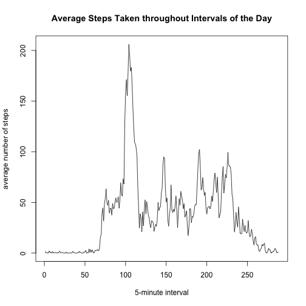
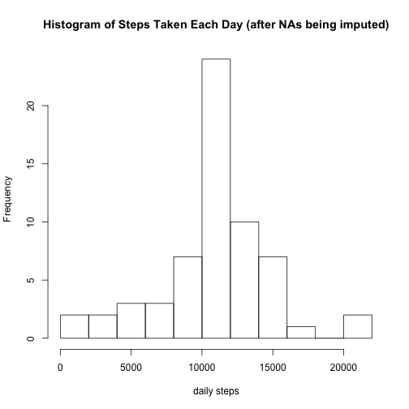
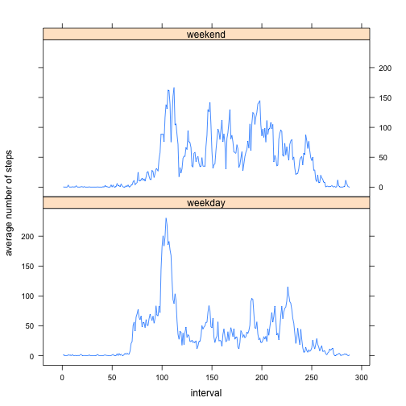

Reproducible Research Peer Assessment 1
=======================================

Make all code chunks available for peer assessment.


```r
library(knitr)
opts_chunk$set(echo = TRUE, results = "asis", warning = FALSE, message = FALSE)
```

## Part 1: ignoring missing values 

After downloading and setting working directory to the unzipped data file (not included in code here), we will load the data and process it to produce a histogram of total number of steps taken each day.


```r
activity <- read.csv("activity.csv")
library(dplyr)
stepsbyday <- activity %>% group_by(date) %>% summarize(daily.steps = sum(steps, na.rm = TRUE))
hist(stepsbyday$daily.steps, breaks = 10, main = "Histogram of Steps Taken Each Day", xlab = "daily steps")
```

 

Calculate mean and median of total number of steps taken each day.


```r
ds_mean <- formatC(mean(stepsbyday$daily.steps), format = "d")
ds_median <- formatC(median(stepsbyday$daily.steps), format = "d")
```

The mean of steps taken each day is 9354, the median is 10395.

Next, we will look at the daily activity pattern by looking at a time series plot of 5-minute interval and number of steps taken in those intervals averaged acrosss all days.


```r
activity$interval <- factor(activity$interval)
stepsbyint <- activity %>% group_by(interval) %>% summarize(avg.steps = mean(steps, na.rm = TRUE)) 
stepsbyint$interval <- as.integer(stepsbyint$interval)
with(stepsbyint, plot(interval, avg.steps, type = "l", main = "Average Steps Taken throughout Intervals of the Day", xlab = "5-minute interval", ylab = "average number of steps"))
```

 

Calculate which 5-minute interval contains the maximum number of steps.


```r
interval_max <- stepsbyint[stepsbyint$avg.steps == max(stepsbyint$avg.steps), ][[1]]
hour <- interval_max %/% 12
minute <- (interval_max %% 12) * 5
timeEND <- paste(hour, minute, sep = ":")
timeSTART <- paste(hour, minute - 5, sep = ":")
```

The 5-minute interval that contains the maximun number of steps on average is interval 104, or from 8:35 to 8:40 in the morning.

## Part 2: imputing missing values

To see how much our calculation in part 1 might be impacted by missing values, we need to calculate the number of rows with NAs.


```r
NAsum <- sum(is.na(activity$steps))
```

There are 2304 rows with NAs.

We are going to fill in the missing values of variable steps by using the average number of steps for that corresponding 5-minute interval calculated in part 1.


```r
activitynew <- mutate(activity, avg.steps = factor(interval, labels = stepsbyint$avg.steps))
activitynew$avg.steps <- as.numeric(as.character(activitynew$avg.steps))
for (i in 1:nrow(activitynew)) {
        if (is.na(activitynew$steps[i])) {
                activitynew$steps[i] <- activitynew$avg.steps[i]
        }
}
activitynew <- select(activitynew, -avg.steps)
```


```r
stepsbyday_new <- activitynew %>% group_by(date) %>% summarize(daily.steps = sum(steps))
hist(stepsbyday_new$daily.steps, breaks = 10, main = "Histogram of Steps Taken Each Day (after NAs being imputed)", xlab = "daily steps")
```

 


```r
ds_mean_new <- formatC(mean(stepsbyday_new$daily.steps), format = "d")
ds_median_new <- formatC(median(stepsbyday_new$daily.steps), format = "d")
```

After missing values are imputed, the mean of steps taken each day is 10766, the median is 10766. These values differ from the estimates in part 1 of this project, becaue by replacing missing data with average number of steps in that corresponding interval, we smooth out the data so that extreme small value has less impact on mean, and the distribution is more centered in the mean.

## Part 3: comparing activity patterns between weekdays and weekends

Create a new factor variable to indicate whether a given date is weekday or weekend


```r
activitynew$date <- as.Date(as.character(activitynew$date))
activitynew <- mutate(activitynew, wdwk = weekdays(date) %in% c("Saturday", "Sunday"))
activitynew$wdwk <- factor(activitynew$wdwk, labels = c("weekday", "weekend"))
```

Now let's compare activity patterns by looking at a panel plot containing a time series plot of 5-minute interval and average number of steps taken, averaged across all weekdays and weekends. 


```r
stepsbyint_new <- activitynew %>% group_by(wdwk, interval) %>% summarize(avg.steps = mean(steps)) 
stepsbyint_new$interval <- as.integer(stepsbyint_new$interval)
library(lattice)
xyplot(avg.steps ~ interval | wdwk, data = stepsbyint_new, layout = c(1, 2), type = "l", ylab = "average number of steps")
```

 

